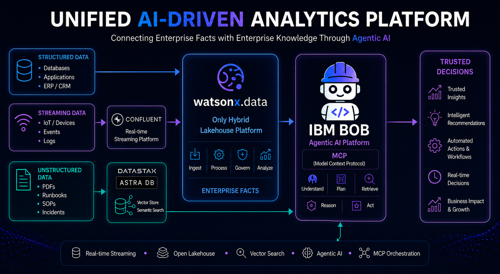
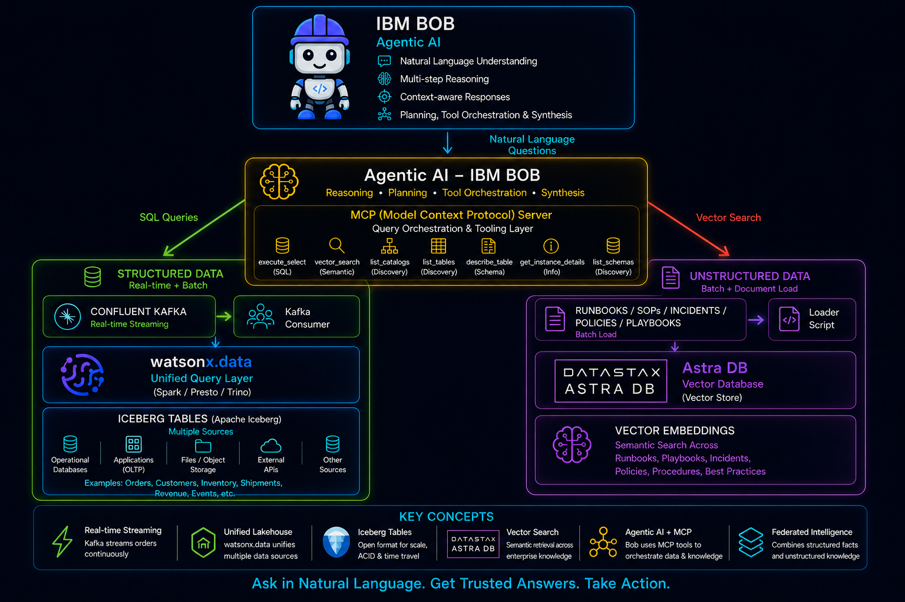

# Unified AI Driven Analytics Platform 

> **Building an intelligent order analysis system with IBM Bob, MCP, watsonx.data, Confluent Kafka, and Astra DB**

[](https://opensource.org/licenses/MIT)
[](https://www.python.org/downloads/)
[](https://modelcontextprotocol.io)

## Overview

This project demonstrates how to build an Unified AI Driven Analytics Platform  that combines:

- **IBM Bob AI** - Natural language interface powered by Claude (Anthropic)
- **MCP (Model Context Protocol)** - Universal adapter between AI and enterprise data
- **watsonx.data** - Unified query layer with Iceberg lakehouse
- **Confluent Kafka** - Real-time streaming with <500ms latency
- **Astra DB** - Vector database for unstructured knowledge

**The Innovation:** Ask questions in plain English and get comprehensive answers combining structured data (orders, inventory, customers) with unstructured knowledge (runbooks, incidents, policies).

## Architecture



### Platform Overview

**UNIFIED AI-DRIVEN ANALYTICS PLATFORM**
*Connecting Enterprise Facts with Enterprise Knowledge Through Agentic AI*

The platform integrates three types of enterprise data:

- **Structured Data**: Databases, Applications, ERP/CRM systems
- **Streaming Data**: IoT/Devices, Events, Logs via **Confluent** real-time streaming
- **Unstructured Data**: PDFs, Runbooks, SOPs, Incidents

All data flows through **watsonx.data** (Only Hybrid Lakehouse Platform) which provides:
- **Ingest**: Data ingestion from multiple sources
- **Process**: Data transformation and processing
- **Govern**: Data governance and security
- **Analyze**: Advanced analytics capabilities

**IBM BOB** (Agentic AI Platform) powered by **MCP** (Model Context Protocol) provides:
- **Understand**: Natural language query understanding
- **Plan**: Strategic planning and analysis
- **Retrieve**: Semantic search via DataStax Astra DB vector store
- **Reason**: Intelligent reasoning over enterprise facts
- **Act**: Automated actions and workflows

This leads to **TRUSTED DECISIONS**:
- Trusted Insights
- Intelligent Recommendations
- Automated Actions & Workflows
- Real-time Decisions
- Business Impact & Growth

**Key Technologies**: Real-time Streaming • Open Lakehouse • Vector Search • Agentic AI • MCP Orchestration

### Detailed Architecture



The detailed architecture shows:

**IBM BOB - Agentic AI**
- Natural Language Understanding
- Multi-step Reasoning
- Context-aware Responses
- Planning, Tool Orchestration & Synthesis

**MCP (Model Context Protocol) Server**
- Query Orchestration & Tooling Layer
- Tools: execute_select, vector_search, list_catalogs, list_tables, describe_table, get_instance_details, list_schemas

**Data Sources**

*Structured Data (Real-time + Batch)*
- Confluent Kafka (Real-time Streaming)
- watsonx.data Unified Query Layer (Spark/Presto/Trino)
- Iceberg Tables (Apache Iceberg) from multiple sources:
  - Operational Databases
  - Applications (OLTP)
  - Files/Object Storage
  - External APIs
  - Other Sources

*Unstructured Data (Batch + Document Load)*
- Runbooks, SOPs, Incidents, Policies, Playbooks
- Astra DB Vector Database (Vector Store)
- Vector Embeddings for semantic search across enterprise knowledge

**Key Concepts**
- Real-time Streaming: Kafka streams orders continuously
- Unified Lakehouse: watsonx.data unifies multiple data sources
- Iceberg Tables: Open format for scale, ACID & time travel
- Vector Search: Semantic retrieval across enterprise knowledge
- Agentic AI + MCP: Bob uses MCP tools to orchestrate data & knowledge
- Federated Intelligence: Combines structured facts and unstructured knowledge

**Ask in Natural Language. Get Trusted Answers. Take Action.**

## Quick Start

### Prerequisites

- Python 3.9+
- watsonx.data instance
- Confluent Cloud account (optional, for streaming)
- Astra DB account (for vector search)
- VS Code with Bob extension

### Installation

1. **Clone the repository**
```bash
git clone https://github.com/your-org/ai-order-intelligence.git
cd ai-order-intelligence
```

2. **Set up Python environment**
```bash
python3 -m venv .venv
source .venv/bin/activate  # On Windows: .venv\Scripts\activate
pip install -r mcp-servers/query-layer/requirements.txt
```

3. **Configure environment variables**
```bash
# MCP Server configuration
cd mcp-servers/query-layer
cp .env.example .env
# Edit .env with your credentials

# Demo scripts configuration
cd ../../demo/scripts
cp .env.example .env
# Edit .env with your credentials
```

4. **Load demo data**
```bash
# Load structured data into Iceberg
# Execute demo/scripts/manual_load_iceberg_all.sql in watsonx.data Query Workspace

# Load unstructured data into Astra DB
cd demo/scripts
python reset_and_load_astra.py
```

5. **Start the MCP server**
```bash
cd mcp-servers/query-layer
python server.py --transport stdio --dotenv .env
```

6. **Configure Bob AI**
- Open VS Code
- Install Bob extension
- Configure MCP server in `.bob/mcp.json`
- Start asking questions!

## Example Queries

### Basic Queries
```
"Show me the details of order O-10452"
"Tell me about customer C-9001"
"What's the inventory status for SKU-881?"
```

### Advanced Analysis
```
"Why is order O-10452 delayed?"
"What should we do about this delay according to our runbooks?"
"How much revenue is at risk from delayed orders?"
```

### Real-Time Queries
```
"Show me orders from the last 5 minutes"
"What items were in the most recent order?"
```

## Key Features

### 1. Natural Language Interface
- Ask questions in plain English
- No SQL knowledge required
- Context-aware responses
- Multi-step reasoning

### 2. Federated Queries
- Query across multiple data sources
- Combine structured + unstructured data
- Single unified view
- Sub-second performance

### 3. Real-Time Streaming
- Kafka to Iceberg pipeline
- <500ms end-to-end latency
- Exactly-once semantics
- Immediate queryability

### 4. Vector Search
- Semantic search on runbooks
- Find relevant procedures automatically
- Past incident analysis
- Policy recommendations

### 5. Agentic AI
- Multi-step reasoning
- Intelligent tool selection
- Result validation
- Comprehensive synthesis

## 📁 Project Structure

```
ai-order-intelligence/
├── README.md                    # This file
├── LICENSE                      # MIT License
├── .gitignore                   # Git ignore rules
│
├── docs/                        # 📚 Documentation
│   ├── agentic-architecture.md  # Architecture deep dive
│   ├── data-model.md            # Data model documentation
│   ├── sequence-flow.md         # Sequence diagrams
│   └── demo.md                  # Live demo script (15-20 min)
│
├── src/                         # 💻 Source Code
│   ├── mcp-server/              # MCP Server (Query Layer)
│   │   ├── server.py            # Main MCP server
│   │   ├── .env.example         # Environment template
│   │   ├── requirements.txt     # Python dependencies
│   │   └── README.md            # Server documentation
│   │
│   ├── kafka-streaming/         # Real-Time Streaming
│   │   ├── kafka_to_iceberg_consumer.py  # Kafka → Iceberg
│   │   ├── orders_producer.py            # Order producer
│   │   ├── requirements.txt              # Dependencies
│   │   └── README.md                     # Streaming guide
│   │
│   └── demo-data/               # Demo Data & Scripts
│       ├── manual_load_iceberg_all.sql   # Load structured data
│       ├── reset_and_load_astra.py       # Load vector data
│       ├── test_vector_search.py         # Test vector search
│       ├── .env.example                  # Environment template
│       ├── requirements.txt              # Dependencies
│       └── runbooks/                     # Runbook PDFs
│           └── pdfs/                     # 6 PDF documents
│
├── .bob/                        # 🤖 Bob AI Configuration
│   ├── mcp.json                 # MCP server config
│   ├── custom_modes.yaml        # Custom modes
│   └── rules-wxd-bob-demo/      # Demo-specific rules
│
└── assets/                      # 🎨 Images & Diagrams
    ├── architecture diagrams    # .drawio files
    └── screenshots              # Demo screenshots
```

### Key Directories

- **`docs/`** - All documentation including blog post and architecture
- **`src/mcp-server/`** - The MCP server that connects Bob AI to data sources
- **`src/kafka-streaming/`** - Real-time streaming pipeline (Kafka → Iceberg)
- **`src/demo-data/`** - Scripts to load demo data and runbooks
- **`.bob/`** - Bob AI configuration for natural language queries

## 🎬 Demo Scenario

The demo uses **Order O-10452** as the anchor scenario:

- **Customer**: Acme Industries (PLATINUM tier, €250K LTV)
- **Problem**: Order delayed due to SKU-881 stockout at WH-BER
- **Solution**: Reroute from WH-FRA (188 units available)
- **Compensation**: 10% credit (€125) per policy

### Demo Questions

1. **Root Cause**: "Why is order O-10452 delayed?"
2. **Customer Profile**: "Tell me about customer C-9001"
3. **Procedures**: "What's our procedure for handling PLATINUM customer delays?"
4. **Complete Analysis**: "Why is order O-10452 delayed, and what should we do about it according to our runbooks?"

## 🔧 Configuration

### MCP Server (.env)

```bash
# Presto/watsonx.data Connection
PRESTO_HOST=your-wxd-instance.cloud.ibm.com
PRESTO_PORT=8443
PRESTO_USER=your-username
PRESTO_PASSWORD=your-password
PRESTO_CATALOG=icebergdefault
PRESTO_SCHEMA=demo_data

# Astra DB Connection
ASTRA_DB_ID=your-db-id
ASTRA_DB_REGION=your-region
ASTRA_DB_TOKEN=your-token
ASTRA_DB_KEYSPACE=your-keyspace
ASTRA_DB_TABLE=runbooks_vector
```

### Kafka Streaming (optional)

```bash
# Confluent Cloud
KAFKA_BOOTSTRAP_SERVERS=your-broker:9092
KAFKA_SASL_USERNAME=your-api-key
KAFKA_SASL_PASSWORD=your-api-secret
```

## Performance Metrics

| Metric | Value | Impact |
|--------|-------|--------|
| **End-to-end latency** | <500ms | Real-time analytics |
| **Query response time** | <1s | Interactive experience |
| **Federated query time** | <2s | Comprehensive insights |
| **Data sources** | 3 types | Unified view |
| **Streaming throughput** | 1000s/sec | Scalable ingestion |

## Use Cases

### Logistics & Supply Chain
- Order delay analysis
- Inventory optimization
- Customer service automation
- Revenue protection

### Healthcare
- Patient records + medical literature
- Real-time vitals monitoring
- Treatment recommendations

### Finance
- Transaction data + regulatory docs
- Real-time fraud detection
- Compliance guidance

### Manufacturing
- Sensor data + maintenance manuals
- Quality monitoring
- Repair procedures

## Technology Stack

- **AI/LLM**: Claude (Anthropic) via IBM Bob
- **Protocol**: MCP (Model Context Protocol)
- **Data Lake**: Apache Iceberg
- **Query Engine**: Presto/Trino (watsonx.data)
- **Streaming**: Confluent Kafka
- **Vector DB**: Astra DB (Cassandra)
- **Embeddings**: sentence-transformers
- **Language**: Python 3.9+

## Documentation

- **[docs/agentic-architecture.md](docs/agentic-architecture.md)** - Architecture details
- **[docs/demo.md](docs/demo.md)** - Live demo script (15-20 min)
- **[docs/data-model.md](docs/data-model.md)** - Data model documentation
- **[docs/sequence-flow.md](docs/sequence-flow.md)** - Sequence diagrams
- **[src/mcp-server/README.md](src/mcp-server/README.md)** - MCP server documentation
- **[src/kafka-streaming/confluent-to-lakehouse-guide.md](src/kafka-streaming/confluent-to-lakehouse-guide.md)** - Streaming guide

---

## Next Steps

1. **Try the Demo**: Follow the Quick Start guide
2. **Understand the Architecture**: Review [docs/agentic-architecture.md](docs/agentic-architecture.md)
3. **Run the Live Demo**: Use [docs/demo.md](docs/demo.md) as your script
5. **Extend the System**: Add your own data sources and tools

**Questions?** Open an issue or reach out!
